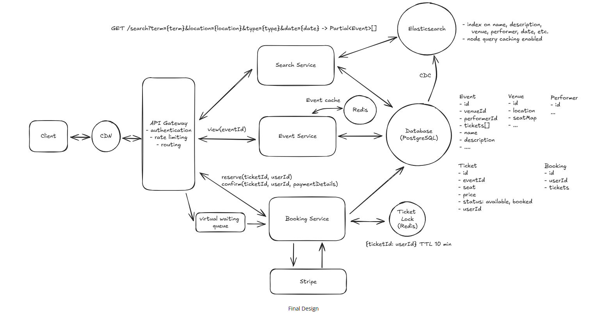

# What is GrabSeat?
GrabSeat is an online platform that allows users to purchase tickets for concerts, sports events, theater, and other live entertainment.

## Core Requirements
1. Users should be able to view events
2. Users should be able to search for events
3. Users should be able to book tickets to events
4. Users should be able to view their booked events
5. Admins or event coordinators should be able to add events
6. Popular events should have dynamic pricing

## API or System Interface
1. The API for viewing events is straightforward. We create a simple GET endpoint that takes in an eventId and return the details of that event.

GET /events/:eventId -> Event & Venue & Performer & Ticket[]

2. Next, for search, we just need a single GET endpoint that takes in a set of search parameters and returns a list of events that match those parameters.
GET /events/search?keyword={keyword}&start={start_date}&end={end_date}&pageSize={page_size}&page={page_number} -> Event[]

3. Reserve a ticket
reserve(ticketId, userId)

4. Confirm payment of ticket
confirm(ticketId, userId, paymentDetails)

## Final Architecure

## Technical guidelines
1. Break this into independent user stories and execute one story at a time for git checkin
2. Use DockerDesktop for deployment
3. Use Posgres for backend with CDC, kafka for search index updates
4. Plan for unit tests, integration tests and end to end tests
5. Create web interface for user and admin actions

Disclaimer for readers of this document- This is borrowed from https://www.hellointerview.com/learn/system-design/problem-breakdowns/ticketmaster